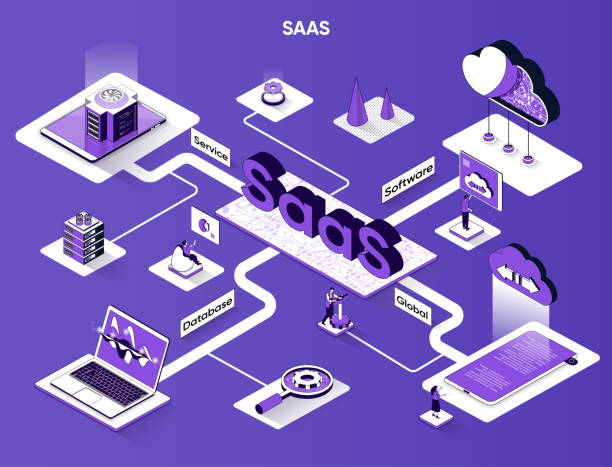

# Express SaaS Template

Software as a service (or SaaS) is a way of delivering applications over the Internet—as a service. Instead of installing and maintaining software, one simply accesses it via the Internet, freeing himself from complex software and hardware management.

See details in **docs** folder.
